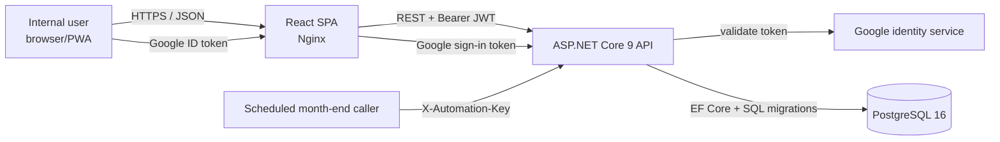
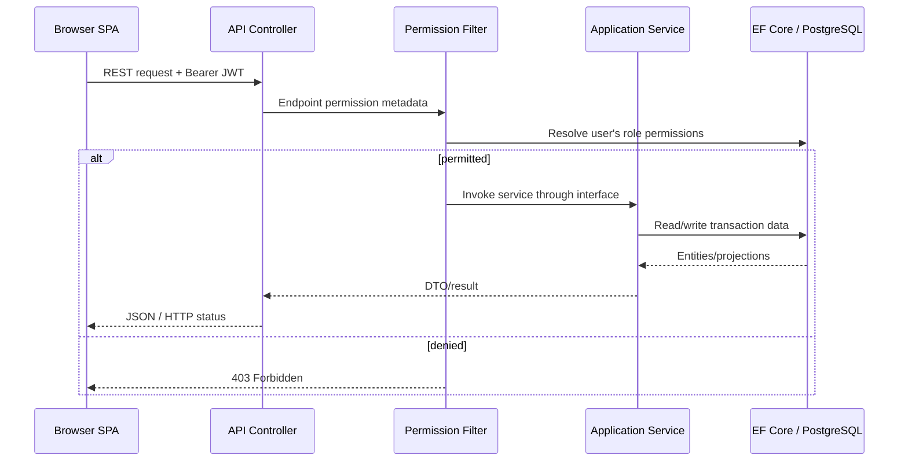
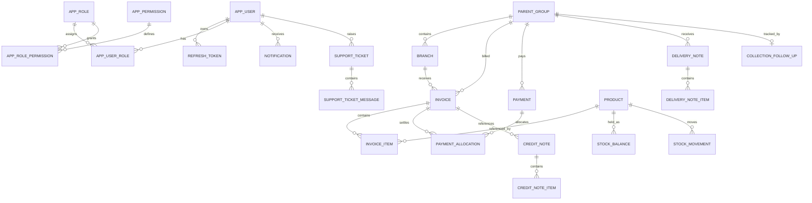

# System Architecture Document

## Nurtured Choice Sales & Distribution System

**Document status:** Architecture baseline for the code in this repository
**Prepared:** 21 September 2026
**Architecture style:** Modular monolith with a React single-page application and PostgreSQL database.

## 1. Scope and architectural intent

This document describes the deployed and source-code architecture, not an aspirational target. The system is a browser application for sales, distribution, inventory, receivables, reporting, and support operations. It is deployed as three containerised services: frontend, API, and PostgreSQL.

The backend follows Clean Architecture-style project separation:

- **Domain:** entities and enumerations with no infrastructure dependency.
- **Application:** DTOs, service interfaces, pagination/results, and cross-layer abstractions.
- **Infrastructure:** EF Core persistence, SQL migration runner, authentication implementation, seed data, and business-service implementations.
- **API:** ASP.NET Core host, controllers, authentication/authorisation pipeline, CORS, rate limiting, exception handling, health check, and startup bootstrap.

The frontend is a TypeScript/React SPA. It owns presentation, client-side route protection, form validation, print/export helpers, PWA shell caching, and IndexedDB offline drafts. Business authority remains on the API.

## 2. System context

The browser and API are configured independently through `VITE_API_BASE_URL` and `Cors:AllowedOrigins`. The API is not a backend-for-public-customer access: all operational API controllers are authenticated except explicit login, registration, Google sign-in, token refresh/logout, health/root, and the keyed month-end automation endpoint.

## 3. Deployment topology

| Component | Technology | Responsibility | Network exposure |
|---|---|---|---|
| Frontend | React 19, Vite build, Nginx 1.27 Alpine | Delivers SPA, PWA shell, static assets, client routing. | Container port 80; Compose maps host 8080. |
| API | ASP.NET Core 9, EF Core, Npgsql | REST endpoints, authN/authZ, business services, reporting, migrations, seeding. | Container port 10000; Compose maps host 10000. |
| Database | PostgreSQL 16 Alpine | Transactional application data and migration history. | Internal Compose service; persistent `postgres-data` volume. |

The API Docker image publishes the API project in Release mode. The frontend Docker image runs `npm ci`, builds the Vite app, and serves `/dist` through Nginx. Docker Compose requires database password, JWT signing key, allowed host, frontend origin, and frontend API URL as environment values.

## 4. Runtime request flow

Controllers are deliberately thin. They receive HTTP input, select the service, obtain the current user where needed, and return HTTP responses. Services in `Infrastructure/Services` contain query, calculation, orchestration, and persistence logic using the injected `SalesDbContext`.

## 5. Frontend architecture

### 5.1 Presentation

`frontend/src/main.tsx` starts the React app. `AppRoutes.tsx` lazy-loads protected pages, while `RequireAuth` and `ProtectedShell` gate the workspace. Major routes cover dashboard, customers, products, stock, invoices, statements, credit notes, delivery notes, payments, collections, reports, portal, settings, offline sync, system health, and support.

The UI uses React Router, TanStack Query, React Hook Form, Zod, Tailwind CSS, and reusable UI components. It has client-side presentation-level validation; server validation and authorisation remain authoritative.

### 5.2 Client integration and resiliency

`frontend/src/lib/api.ts` is the API boundary. It adds JSON handling, bearer access token, refresh-token retry on authentication failure, timeout handling, and offline request queuing. Auth tokens and the displayed user profile are stored in browser local storage.

The PWA service worker caches same-origin navigation and static assets but explicitly does not cache `/api/` network responses. `offlineStore.ts` uses IndexedDB for a seven-day API-value cache and a local queue of invoice, payment, and stock drafts. Replays are explicit client actions; they are not an exactly-once distributed workflow.

## 6. API architecture

### 6.1 Cross-cutting pipeline

`Program.cs` configures the following, in request order:

1. Console logging and configuration from appsettings, environment-specific settings, user secrets in development, and environment variables.
2. Controllers, health checks, DI registration, JWT/Google services, and global permission filter.
3. Authentication and authorisation using JWT bearer tokens.
4. CORS policy restricted to configured frontend origins (local development fallbacks only outside production).
5. Fixed-window auth rate limiting: 30 requests/minute/client IP.
6. Security headers: `nosniff`, frame denial, referrer policy, and camera-only permission policy.
7. Optional HTTPS redirection, CORS, rate limiter, authentication, authorisation, controllers, and health endpoint.

Unhandled exceptions become JSON problem responses. The current global handler treats `InvalidOperationException` as a 409 Conflict and all other unhandled failures as 500; controller and service code should therefore return intentional 400/404/409 responses for expected conditions whenever possible.

### 6.2 Authentication and authorisation

Password authentication uses ASP.NET Core Identity's `PasswordHasher<AppUser>`. Google sign-in validates an ID token using configured client identity. On successful authentication, `TokenService` creates an HMAC-SHA256 JWT containing subject, email, display name, token ID, and role claims. Refresh tokens are random 64-byte values persisted through the identity service.

`PermissionFilter` runs on controller actions and reads the most specific `Permission` attribute. `PermissionService` resolves whether the authenticated user's roles carry that permission. A controller/action with no permission attribute is not automatically permission-gated, so new endpoints must explicitly declare both `[Authorize]` and the appropriate permission where role restriction is required.

### 6.3 REST surface

The API is rooted at `/api/v1`. Main controller groups are:

| Group | Responsibility |
|---|---|
| `auth` | Registration, password/Google login, refresh/logout, current user. |
| `users` | User listing, role/status updates, and deletion. |
| `parent-groups` | Customer parent groups and branches. |
| `products`, `stock` | Catalogue and stock dashboard. |
| `invoices`, `payments`, `credit-notes`, `delivery-notes`, `statements` | Commercial/receivables documents. |
| `collections`, `reports`, `dashboard` | Receivables and analytical projections. |
| `settings`, `notifications`, `reminders` | Configuration and user operational messages. |
| `support`, `health` | Support tickets and health reporting. |

For exact request and response fields, DTOs in `backend/src/NurturedChoice.Application/DTOs` and the controller methods are authoritative. The older `docs/api-contracts.md` is a planning reference and is not a complete contract for the current build.

## 7. Persistence and data architecture

### 7.1 ORM and schema management

`SalesDbContext` is EF Core's unit of work and maps entity sets for identity, catalogue, customers, billing, inventory, settings, notifications, reminders, and support. The database provider is Npgsql/PostgreSQL and uses connection resiliency (`EnableRetryOnFailure`).

Production uses snake_case columns. The startup bootstrap executes embedded numbered SQL migrations, tracked in the `schema_migrations` table, then applies compatibility `CREATE TABLE IF NOT EXISTS` statements and reference-data seeding. Existing databases with the older quoted-PascalCase schema are detected and baseline SQL migrations are marked as applied to avoid incompatible replay.

This mixed SQL/EF compatibility strategy is intentional for upgrade support but adds schema risk. New database work should be created as an ordered SQL migration, embedded in the Infrastructure project, and verified against both a clean database and an upgrade database.

### 7.2 Logical data model

Core tables include `app_users`, roles/permissions/link tables, `refresh_tokens`, `parent_groups`, `branches`, `products`, product images, invoice and payment tables, credit and delivery note tables, statements/lines, stock balance/movement/adjustment tables, collection follow-ups, settings/company profile, notifications/reminders, and support tickets/messages.

Most business entities derive audit fields: ID, created/updated metadata, soft-delete metadata, and row version. This is a convention rather than a guarantee of immutable financial history: current invoice deletion physically removes the invoice and its items, while clearing affected allocation/reference links.

### 7.3 Important consistency behaviours

- Invoice draft creation uses an EF execution strategy and database transaction. It generates/checks the invoice number, calculates totals, writes the invoice/items, and commits together.
- Invoices are finalised by status change; the API rejects update requests for non-draft invoices.
- Payments and credit notes reference invoices optionally, allowing invoice deletion to remove the link without deleting the payment/credit note.
- Accounts-receivable ageing derives outstanding balance from eligible invoice total minus non-deleted payment allocations; it is a read model, not a stored ledger balance.
- `Product.CurrentStock` is the reporting and dashboard source of truth. Product updates and the stock-adjustment transaction also update the unbranched `StockBalance` record for compatibility with the existing inventory data model.

## 8. Operational security model

Production startup refuses to start when the JWT signing key is empty, default/placeholder, or shorter than 32 characters; when the database connection is missing/placeholder; or when `AllowedHosts` is wildcard/empty. CORS must similarly define deployed frontend origins in production.

Secrets are configuration, not code: database password, connection string, JWT signing key, Google client ID, CORS origin, allowed host, demo-seed password, and month-end automation key must be supplied through approved secret management or environment injection. The provided Compose file demonstrates environment variable wiring but is not itself a secret store.

The frontend persists tokens in local storage, which makes browser XSS prevention especially important. Preserve the content-security posture, minimise third-party script exposure, and consider moving refresh tokens to secure HttpOnly cookies if the threat model requires stronger browser token protection.

## 9. Observability, operations, and recovery

- API diagnostics use console logging; endpoint health is available at `/api/v1/health`.
- SQL migration application and reference seeding happen at API startup. A failed migration prevents a healthy application start.
- PostgreSQL persistence is held in the named `postgres-data` volume in Compose. Repository scripts include database backup/restore tooling and a standalone data-migration project.
- There is no implemented central log aggregation, metrics/tracing backend, alerting integration, or scheduled-job runtime. The month-end reminder endpoint needs an external scheduler/caller.

Operational runbooks should cover: secret rotation, backup/restore testing, migration rollback strategy, failed offline replay review, privileged user/role changes, and document deletion approval.

## 10. Architecture constraints and risks

| Risk/constraint | Evidence and impact | Required decision or control |
|---|---|---|
| Financial-record deletion | Invoices are permanently deleted and links cleared. | Define a void/cancel/retention policy; restrict or replace permanent deletion before production finance use. |
| Competing stock sources | Dashboard uses `Product.CurrentStock`; valuation reports aggregate `StockBalances`. | Establish one source of truth and automated reconciliation. |
| Schema compatibility path | Existing PascalCase schemas are treated as baseline rather than migrated through all SQL. | Test upgrades from every supported version; retire compatibility path when safe. |
| Offline replay | Browser-local queue lacks idempotency and conflict handling. | Add idempotency keys, server-side sync protocol, and user-visible conflict policy before relying on offline posting. |
| Automation endpoint | Month-end task relies on an external caller and shared key. | Configure a scheduler, rotate key, monitor failures, and restrict caller network path. |
| Report scale | Some reports load broad source sets and cap output at 1,000 rows. | Add filter/date parameters, indexes, and asynchronous exports as data volume grows. |
| Test depth | Repository test projects currently contain smoke-test scaffolding. | Add domain, API authorisation, migration, concurrency, and financial-reconciliation test coverage. |

## 11. Engineering standards for change

1. Add DTOs/interfaces in Application, implementations in Infrastructure, and HTTP endpoints in API; do not let controllers become the business-rule layer.
2. Attach `[Authorize]` and explicit permission metadata to every protected capability. Add permissions/role mapping through the seed and migration strategy deliberately.
3. Use a numbered SQL migration for persistent schema changes and test a fresh install plus an upgrade database.
4. Keep financial calculations decimal-based, transact dependent writes, and preserve or deliberately model document lifecycle transitions.
5. Update the PRD, this document, API DTO documentation, and test coverage as part of any material capability change.

## 12. Source map

| Concern | Primary source location |
|---|---|
| API composition/security | `backend/src/NurturedChoice.Api/Program.cs` |
| HTTP surface | `backend/src/NurturedChoice.Api/Controllers` |
| Data mapping/migrations/seeding | `backend/src/NurturedChoice.Infrastructure/Persistence` and `backend/migrations` |
| Business services | `backend/src/NurturedChoice.Infrastructure/Services` |
| Entity model | `backend/src/NurturedChoice.Domain/Entities` |
| Frontend routes/integration | `frontend/src/routes`, `frontend/src/lib/api.ts`, `frontend/src/context` |
| Deployment | `docker-compose.yml`, `backend/Dockerfile`, `frontend/Dockerfile` |
